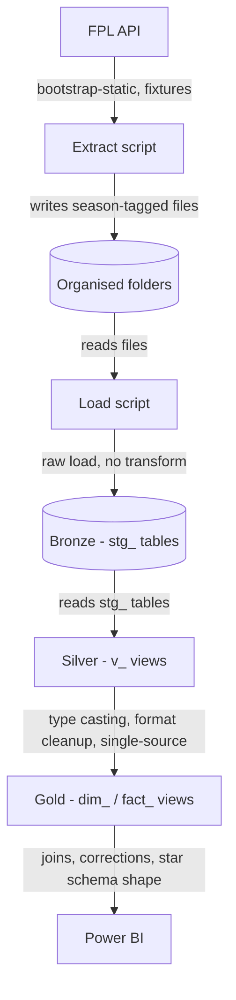
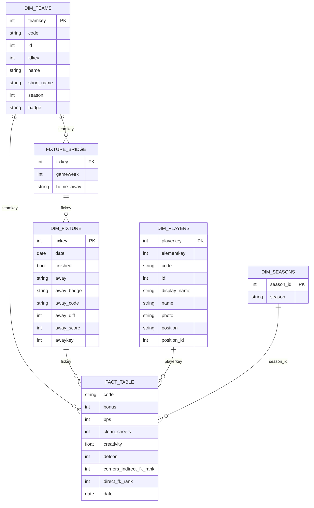

# FPL-Hub-V3
FPL analytics pipeline redesigned for scalability ahead of the new season. A season variable now tags files/columns, organizes raw data by folder, and feeds bronze/silver/gold SQL staging. Composite season-based surrogate keys tie it all together into a Power BI star schema.

## Tech stack

- **Source**: FPL API (`bootstrap-static`, fixtures endpoints)
- **Extraction / loading**: Python (pandas, SQLAlchemy, pyodbc)
- **Database**: SQL Server 2025, SSMS
- **Transformation**: T-SQL (bronze/silver/gold views)
- **Reporting**: Power BI Desktop (Import mode, DAX)

