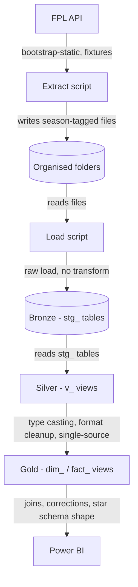
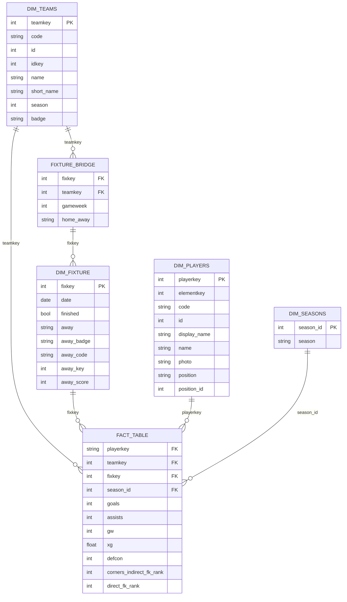

# FPL-Hub-V3

FPL analytics pipeline redesigned for scalability ahead of the new season. A season variable now tags files/columns, organizes raw data by folder, and feeds bronze/silver/gold SQL staging. Composite season-based surrogate keys tie it all together into a Power BI star schema.

Key Changes:
- More efficient scalable Data Model 
- More contextualised KPIs to drive decision making
## 📊 Dashboard

**[View Live Dashboard](https://tinyurl.com/fplhubv3)**

## Architecture overview

## Tech stack

- **Source**: FPL API (`bootstrap-static`, fixtures endpoints)
- **Extraction / loading**: Python (pandas, SQLAlchemy, pyodbc)
- **Database**: SQL Server 2025, SSMS
- **Transformation**: T-SQL (bronze/silver/gold views)
- **Reporting**: Power BI Desktop (Import mode, DAX)

## Data model

The data model is a star schema built around `fact_table`, one row per player per gameweek. Four dimensions surround it: `dim_players`, `dim_teams`, `dim_fixture`, and `dim_seasons`. A `fixture_bridge` table sits between `dim_teams` and `dim_fixture`, giving each fixture two rows (home and away) so a fixture can be filtered by either team. Team assignment lives on the fact table rather than on `dim_players`, since players transfer between clubs mid-season and a dimension table can only hold one team per player.

Column lists below are representative, not exhaustive; some tables have additional fields not shown.

**Notes on keys and relationships:**

- `dim_teams` reaches `fact_table` two ways: directly, and via `fixture_bridge → dim_fixture`. Both are active. Tested against real data with no ambiguity in results.
- `dim_players.elementkey` is not a modelled relationship. It's used only as a `LOOKUPVALUE` in DAX to resolve leaderboard-style fields (most captained, most transferred in) that are stored as seasonal based element ids rather than the global codes.
- `dim_players.code` is stable across seasons, unlike `playerkey`, which is season-scoped. Used for cross-season lookups (e.g. prior season form).
- - The relationship between `dim_players`/`dim_teams` and `fact_table` is intentionally bidirectional. Because `playerkey` and `teamkey` are season-scoped, a season filter needs to propagate in both directions to correctly constrain both dimensions as more seasons are added.
- `fixture_bridge` exists to let a fixture, which naturally has two teams, be filtered by either team individually, one row per team per fixture rather than one row per fixture.

